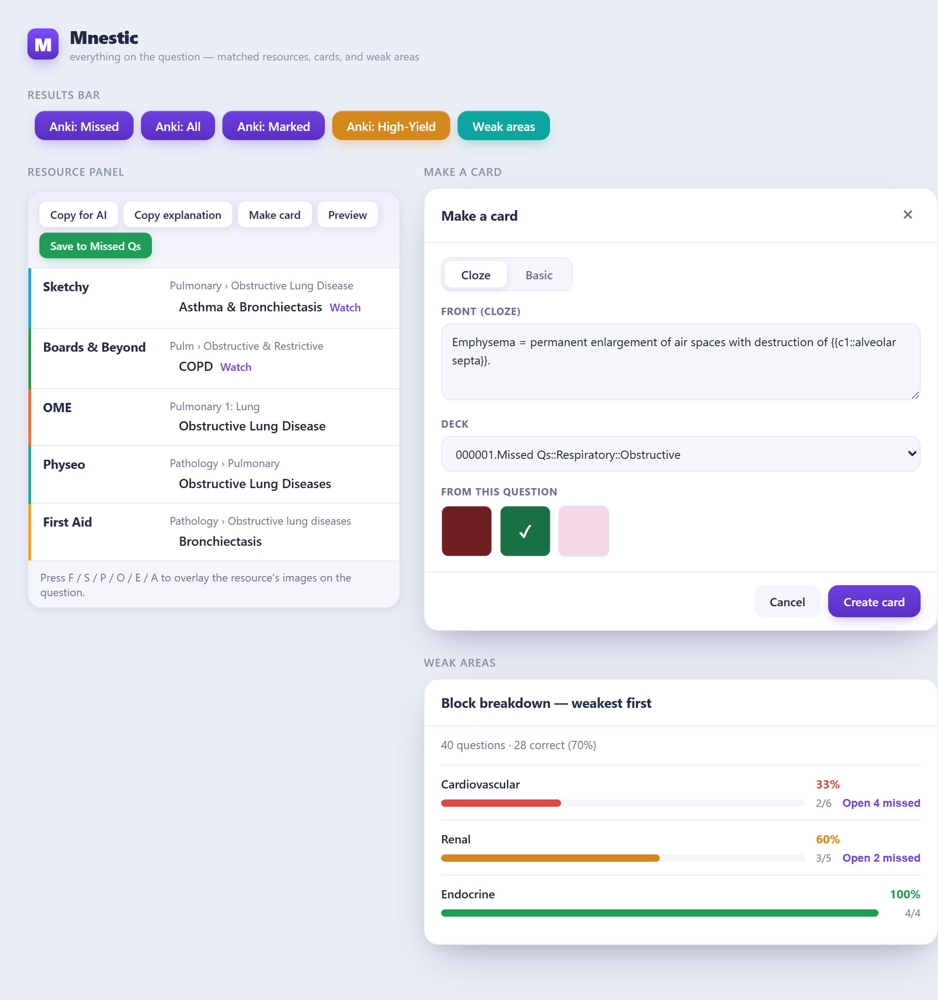
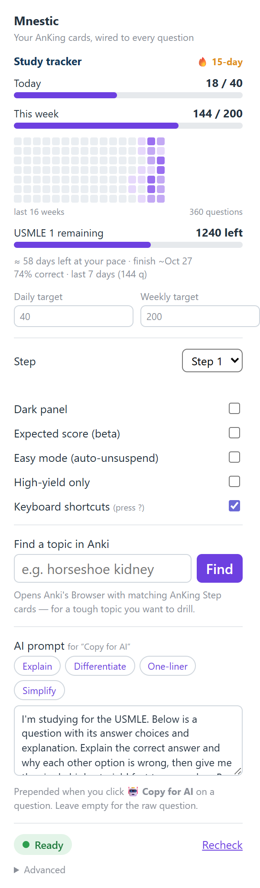
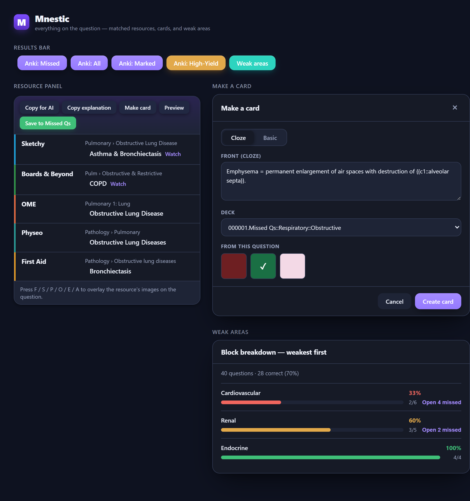
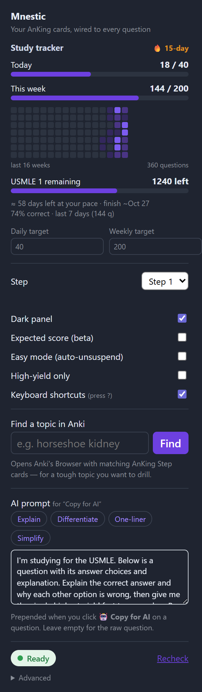
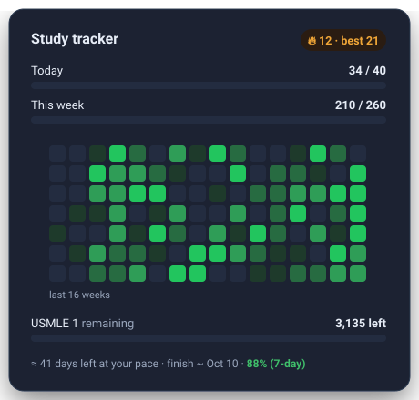

# Mnestic



**Mnestic** links every question in your qbank to your **AnKing** Anki cards. On a
question it shows the matching resources (Sketchy, Boards & Beyond, First Aid, …)
and their images **right on the page**, unsuspends the matching cards in bulk,
lets you **make and keep cards without leaving the question**, breaks a block down
into your **weakest areas**, and tracks your **study pace** — all through a small
local link to your own Anki.

> A personal, educational study tool. You bring your own qbank access and your own
> AnKing deck. **MIT-licensed** and open source. Inspired by the idea behind
> [Atlas](https://github.com/TheEverion/Atlas) — see *Credits* at the bottom.

## Screenshots

| The panel, card composer & weak areas | The popup |
|:---:|:---:|
|  |  |
| Matched resources, **Make a card** (with the *From this question* picker), and the weakest-first breakdown. | Streak, 16-week heatmap, targets, settings, and the editable AI prompt. |

<details><summary>🌙 Dark mode</summary>

| Interface | Popup |
|:---:|:---:|
|  |  |

</details>

## At a glance


## A look at it

### 📚 Resource overlays — the one you'll use every question

Reading a question, press **F** for First Aid, **S** for Sketchy, **P** for
Physeo, **O** for OME (also **E** / **A**) — the matched **AnKing** resource pops
up right over the question. No tab-switching, no losing your place.



### The rest of the workflow

| ✚ Make a card — 📎 *From this question* | 🤖 Copy for AI |
|:---:|:---:|
|  |  |
| Cloze / Basic straight into Anki — and click only the question's images worth keeping. | Prompt presets + the whole question, copied for ChatGPT / Claude / Gemini. |

| 📊 Weak-area breakdown | 🔥 Study tracker |
|:---:|:---:|
|  |  |
| Per-System/Subject/Topic accuracy, weakest-first, "Open N missed" → Anki. | Daily streak, 16-week heatmap, targets, projected finish, 7-day accuracy. |

## How it works (30-second version)

The qbank reuses UWorld's question IDs, and the AnKing deck tags each UWorld
question with that same ID. So the matching is just one local Anki search — no
server, no database:

```
Question Id 2  ->  search Anki:  tag:#AK_Step1_v*::#UWorld::*::2
```

The extension reads the ID off the page; our **Mnestic Bridge** add-on
(`127.0.0.1:8790`) runs that search in your own collection and returns the cards.
Everything stays on your machine.

## Repo layout

```
extension/                 ← the Chrome extension (load this)
  manifest.json            ← matches your qbank site
  content.js               ← matching engine + site adapter + all features
  background.js            ← proxy to the bridge at 127.0.0.1:8790
  popup.html / popup.js    ← settings, study tracker, topic search, pairing
  icons/
anki-addon/
  mnestic_bridge/          ← the Anki add-on — "Mnestic Bridge"
    __init__.py            ← local bridge: search / browse / media / make cards
    config.json            ← port + pairing token
    config.md / manifest.json
LICENSE                    ← MIT
```

## Prerequisites

- **Anki** running, with the **Mnestic Bridge** add-on installed (below).
- Your **AnKing** deck, with the UWorld tags that end in the question id
  (`#AK_Step1_v*::#UWorld::…::<qid>`) — this is what makes matching possible.
- Chrome / Brave / Edge.

## Install

### 1. Anki add-on — "Mnestic Bridge"

Copy the `anki-addon/mnestic_bridge/` folder into your Anki add-ons directory:

| OS | Add-ons folder |
|----|----------------|
| Windows | `%APPDATA%\Anki2\addons21\mnestic_bridge\` |
| macOS | `~/Library/Application Support/Anki2/addons21/mnestic_bridge/` |
| Linux | `~/.local/share/Anki2/addons21/mnestic_bridge/` |

Then **restart Anki**. It listens on `127.0.0.1:8790` — a **local** add-on that
Anki never auto-updates or overwrites.

### 2. Browser extension

1. `chrome://extensions` → enable **Developer mode**.
2. **Load unpacked** → select the `extension/` folder.

### 3. Pair them (one time)

The bridge is protected by a private **pairing code** so nothing else on your
computer can reach your Anki through it. In Anki, click **Tools → “Mnestic:
pairing code…”** (it copies the code to your clipboard). Open the Mnestic popup,
paste it into the **Pairing code** box, and click **Save**. The status pill turns
**Ready**.

> The popup tells you exactly what's missing: *Anki not connected* (start Anki),
> *Enter pairing code* (paste the code), or *Ready*.

## ⚠️ Verify the IDs line up (do this first)

The whole thing rests on one assumption: **your qbank's "Question Id" is the same
number UWorld used**, and your AnKing cards are tagged with it. Check one:

1. On a question, note its header **"Question Id: N"**.
2. In Anki's Browse, search: `tag:#AK_Step1_v*::#UWorld::*::N`
3. If the card(s) that come back are the **same topic** → the IDs match and
   everything will work. If you get nothing or an unrelated card, the qbank
   renumbered the questions and this tag approach won't work as-is.

## Usage

- **Results page** (the score table): **Anki: Missed / All / Marked / High-Yield**
  open those questions' cards in Anki's Browser (or unsuspend them with *Easy
  mode* on), plus **📊 Weak areas** — a per-**System/Subject/Topic** accuracy
  breakdown of the block, weakest-first, with an *Open N missed* button that sends
  just that group to Anki. Open the **"Question List"** popup once per test so
  *Marked* and un-paginated *All / Missed* have the full, colour-coded list.
- **Review a question**: a resource panel lists the matching AnKing resources;
  press **F / S / P / O / E / A** to overlay First Aid / Sketchy / Physeo / OME /
  Extra / Additional Resources images right on the question. OME and Picmonic show
  too, so **Step 2/3** resources light up alongside the Step-1 ones.
- **Quick open in Anki** (question header): a small **Anki** button opens that
  question's AnKing cards in Anki's Browser.
- **Note-taking** (panel header):
  - **🤖 Copy for AI** — copies your editable **AI prompt** + the question id +
    link + the whole question (stem, choices, explanation), ready to paste into
    ChatGPT / Claude / Gemini. Presets: Explain / Differentiate / One-liner /
    Simplify.
  - **📝 Copy explanation** — just the qbank's explanation, for your notes.
  - **👁 Preview** — reads the matched card(s) (clozes revealed, **images
    inline**) with **‹ Prev / Next ›** across every card matched to the question.
  - **★ Save to Missed Qs** — duplicates the matched card into a chapter deck and
    appends **your note** to its *Missed Questions* field. Paste a screenshot, add
    files, or **click a thumbnail of the question's own image** (“📎 From this
    question”) to attach only the ones that matter. The original card is left
    untouched; the copy is unsuspended.
  - **✚ Make card** — turn any explanation text into a brand-new Cloze/Basic card
    (select text → a floating **✚ Make card** chip appears), created in Anki with
    the QID + link as the source. Paste screenshots into it too.
- **Find a topic in Anki** (popup): type a topic → opens Anki's Browser with the
  matching AnKing Step cards, for drilling a tough topic outside the qbank.
- **Keyboard shortcuts** (review page): **G** make card · **Q** copy for AI ·
  **V** save to Missed Qs · **D** open in Anki · **F/S/P/O/E/A** image overlays ·
  **?** cheatsheet · **Esc** close. Ignored while typing; toggle off in the popup.
- **All USMLE steps**: the AnKing step (1/2/3) is auto-detected from the qbank URL,
  so the tag query follows you across steps. The popup's Step selector is the
  fallback when the URL doesn't say.
- **Study tracker** (popup): **today** and **this week** vs your targets, a 🔥
  **daily streak**, a **16-week heatmap**, a **projected finish date**, **7-day
  accuracy**, and **remaining** vs the qbank total (visit the dashboard once so it
  can read Used / Unused / Total).

## Credits & license

- **Open source under the [MIT License](LICENSE).**
- The core idea — mapping a qbank's question IDs onto AnKing's UWorld tags — was
  **inspired by [Atlas](https://github.com/TheEverion/Atlas)** by TheEverion.
  Mnestic is an **independent project, written from scratch** (its own extension
  and its own add-on) with a larger feature set; it does not include Atlas's code.
  Thanks to TheEverion for the original concept.
- **Not affiliated** with Coursology, UWorld, AnKing, Anki, Sketchy, Boards &
  Beyond, Physeo, First Aid, or any other resource. Use your own accounts and
  decks. Resource names and images belong to their owners; Mnestic only points to
  content you already have in your AnKing deck.
