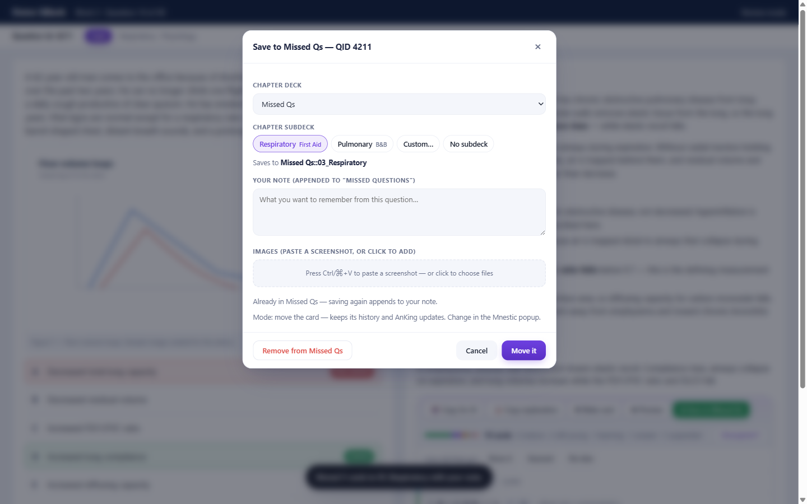
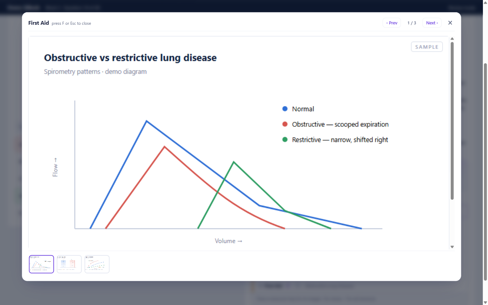
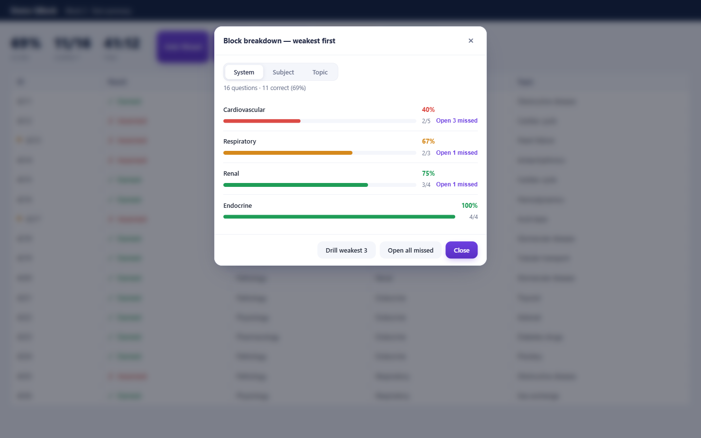

<div align="center">


# Mnestic

**Your qbank question, wired to your AnKing cards.**

[](https://chromewebstore.google.com/detail/mnestic/mdjekpfeinjdgkjbeaffbpfhodofhfhd)
[](https://ankiweb.net/shared/info/199262916)
[](https://github.com/KhaledMD4321/mnestic/releases/latest)
[](LICENSE)
[](https://buymeacoffee.com/bnkhaled)

[**▶️ Watch the 2-minute walkthrough**](https://github.com/KhaledMD4321/mnestic/releases/download/v1.3.1/mnestic-tutorial.mp4) · [**📖 Extension guide**](docs/guide.md) · [**🔌 Add-on guide**](docs/addon-guide.md) · [**Install**](#install) · [**Features**](#what-it-does) · [**Privacy**](PRIVACY.md)

</div>

---

Answer a question on **UWorld**, **Coursology** or **MedPark**, and Mnestic finds
the AnKing cards tagged with that question's id — then puts everything you'd
otherwise open a tab for **right on the page**: the matched resources and their
images, the card as Anki will show it, a weak-area breakdown of the block, and
your study pace.

Everything runs on your own computer, through a small local link to your own Anki.
**No server, no account, no telemetry.**


<div align="center"><sub>Recorded from the extension itself. The question, card and
diagrams are written for the demo — see <a href="scripts/demo-fixtures.js">scripts/demo-fixtures.js</a>.</sub></div>

---

## What it does

<table>
<tr>
<td width="50%" valign="top">

### 📚 Resource overlays
Press **F** for First Aid, **S** for Sketchy, **P** for Physeo, **O** for OME —
the matched image appears over the question. No tab-switching, no losing your
place.

</td>
<td width="50%" valign="top">

### ★ Missed questions, organised
Keep a question in a **chapter subdeck** built from its own AnKing tags, with
your notes in the card. Move it, tag it, or copy it — and **undo** any of it.

</td>
</tr>
<tr>
<td valign="top">

### 📊 Weak areas
Break a finished block into per-**System / Subject / Topic** accuracy, weakest
first, and send just those missed questions to Anki.

</td>
<td valign="top">

### 🔥 Study tracker
Daily streak, 16-week heatmap, targets, 7-day accuracy, and a projected finish
date from your real pace.

</td>
</tr>
<tr>
<td valign="top">

### ✚ Make a card
Select any explanation text → a **Make card** chip appears. Cloze or Basic,
straight into Anki, with the question id as the source.

</td>
<td valign="top">

### 🤖 Copy for AI
Your editable prompt + the whole question, copied in one click for ChatGPT,
Claude or Gemini.

</td>
</tr>
</table>

<div align="center">

[**→ Every feature, explained in the full guide**](docs/guide.md)

</div>

---

## See it work

### Keep a missed question — and take it back out

Saving puts the card in a chapter subdeck with your note. Reopening the dialog
offers **Remove from Missed Qs**, which untags it, moves it home, and keeps
everything you typed.


### Break down a finished block


### The panel, and the popup

| On the question | In the popup |
|:---:|:---:|
|  |  |
| Five resources collapsed to a line each, with their overlay keys — plus how the matching cards stand, and one-click Unsuspend. | Streak, 16-week heatmap, pace and projected finish, and every setting. |

<details><summary>More stills</summary><br>

| | |
|:---:|:---:|
|  |  |
| The save dialog: chapter chips read from the card's own AnKing tags. | Already saved, so undo is on offer. |
|  |  |
| An overlay with its pager and filmstrip. | Per-system accuracy with *Open N missed*. |

</details>

<details><summary>🌙 Dark mode</summary><br>

| Interface | Popup |
|:---:|:---:|
|  |  |

</details>

<details><summary>📐 Illustrated overview</summary><br>


| ✚ Make a card — 📎 *From this question* | 🤖 Copy for AI |
|:---:|:---:|
|  |  |

</details>

---

## Supported question banks

| Bank | Status |
|---|---|
| **Coursology** — `coursology-qbank.com` | ✅ verified against the live site |
| **MedPark** — `medpark.io` | ✅ verified against the live site |
| **UWorld** — `uworld.com` | 🧪 **beta** — built against fixtures, not a live account |

All three label questions with the **same UWorld question ids**, which is what
makes one AnKing tag search work everywhere. Two MedPark features are unavailable
for reasons on its side — [details in the guide](docs/guide.md#supported-banks).

---

## Install

**You need:** Anki running · an AnKing deck with UWorld tags · Chrome, Brave or Edge.

*Want it spelled out click by click?* → [**INSTALL.md**](INSTALL.md)

<table>
<tr><td width="33%" valign="top">

### 1️⃣ Anki add-on

**Tools → Add-ons → Get Add-ons…**

```
199262916
```

Then **restart Anki**.

</td><td width="33%" valign="top">

### 2️⃣ Extension

[**Add to Chrome**](https://chromewebstore.google.com/detail/mnestic/mdjekpfeinjdgkjbeaffbpfhodofhfhd) from the Web Store.

Or load it unpacked: `chrome://extensions` → **Developer mode** → **Load
unpacked** → the `extension/` folder.

</td><td width="33%" valign="top">

### 3️⃣ Pair them

**Tools → Mnestic Bridge → Pairing code…**

Paste it into the popup → **Save**. The pill turns **● Ready**.

</td></tr>
</table>

> [!IMPORTANT]
> **Check one question first.** Everything rests on your qbank's question id being
> the same number UWorld used. Take a question id from the page, search
> `tag:#AK_Step1_v*::#UWorld::*::<id>` in Anki's Browse, and confirm the same topic
> comes back. [How and why →](docs/guide.md#2-check-your-ids-match)

<details><summary>Install the add-on manually instead</summary><br>

Copy `anki-addon/mnestic_bridge/` into your Anki add-ons folder, then restart Anki:

| OS | Folder |
|---|---|
| Windows | `%APPDATA%\Anki2\addons21\mnestic_bridge\` |
| macOS | `~/Library/Application Support/Anki2/addons21/mnestic_bridge/` |
| Linux | `~/.local/share/Anki2/addons21/mnestic_bridge/` |

</details>

---

## How it works

The AnKing deck tags every UWorld question with its id, and all three banks use
those same ids. So the matching is one local Anki search — no server, no database:

```
Question Id 1633   →   (tag:#AK_Step1_v*::#UWorld::Step::1633
                        OR tag:#AK_Step1_v*::#UWorld::1633)
```

The extension reads the id off the page; the **Mnestic Bridge** add-on
(`127.0.0.1:8790`) runs that search in your own collection and returns the cards.

Both tag shapes are tried because AnKing has used both — older decks and Step 3
carry the bare form. A wildcard fallback exists for anything else, but it is
never tried first: it can reach into other exam namespaces and match the wrong
question.

---

## Safety

Mnestic can read the page you're studying and **write to your Anki collection**,
so the limits are worth stating plainly:

- **Nothing leaves your computer.** No server, no account, no analytics.
- **The bridge is locked to loopback**, needs your pairing code on every request,
  and refuses any request whose origin is a website.
- **The add-on cannot delete your cards.** Its one delete operation exists to undo
  a *Make a copy* save and refuses any note it did not itself create.
- **It only removes its own tags** — never `marked`, `leech`, an AnKing tag, or the
  `AnkiHub_Protect` tag guarding notes you typed.

Full detail, and how to report a problem: [SECURITY.md](SECURITY.md) ·
[PRIVACY.md](PRIVACY.md)

---

## Repo layout

```
extension/               the browser extension
  manifest.json          the qbank sites it runs on
  content.js             matching engine, site adapters, every on-page feature
  background.js          proxy to the bridge at 127.0.0.1:8790
  popup.html/.js         tracker, settings, missed list, pairing
anki-addon/
  mnestic_bridge/        the Anki add-on — local bridge + Tools menu
scripts/                 build, test and the demo recorder
docs/                    the guides, release runbook, store copy, demo media
```

<details><summary>Building and testing</summary><br>

```bash
python scripts/check-addon.py    # the add-on can actually import
python scripts/check-listing.py  # store copy fits the store's limits
python scripts/guard-test.py     # destructive ops refuse what they should
node   scripts/adapter-test.js   # every site adapter still parses its pages
node   scripts/e2e-test.js       # the real extension, in a real browser
```

Re-record the demos in `docs/media/` (drives the real extension, needs ffmpeg):

```bash
node scripts/demo-capture.js            # stills + GIFs
node scripts/demo-capture.js --shots    # stills only, much faster
```

Release process: [docs/releasing.md](docs/releasing.md)

</details>

---

## Support

Mnestic is free and open source, with no ads, accounts, or paid tier — and it will
stay that way. If it saved you time, you can
[**☕ buy me a coffee**](https://buymeacoffee.com/bnkhaled). Entirely optional;
nothing is locked behind it.

Something broken? [Open an issue](https://github.com/KhaledMD4321/mnestic/issues).

---

## Credits & license

**[GNU GPL v3](LICENSE).** You may use, study, modify and share it — anything you
distribute that builds on it must stay open under the same licence, with credit.

The core idea — mapping a qbank's question ids onto AnKing's UWorld tags — was
**inspired by [Atlas](https://github.com/TheEverion/Atlas)** by TheEverion.
Mnestic is an independent project written from scratch, with its own extension and
its own add-on; it includes no Atlas code. Thanks to TheEverion for the concept.

**Not affiliated** with Coursology, UWorld, MedPark, AnKing, Anki, Sketchy, Boards
& Beyond, Physeo, First Aid, or any other resource. Use your own accounts and your
own decks. Resource names and images belong to their owners; Mnestic only points
to content already in your AnKing deck.

<div align="center"><sub>A personal, educational study tool.</sub></div>
