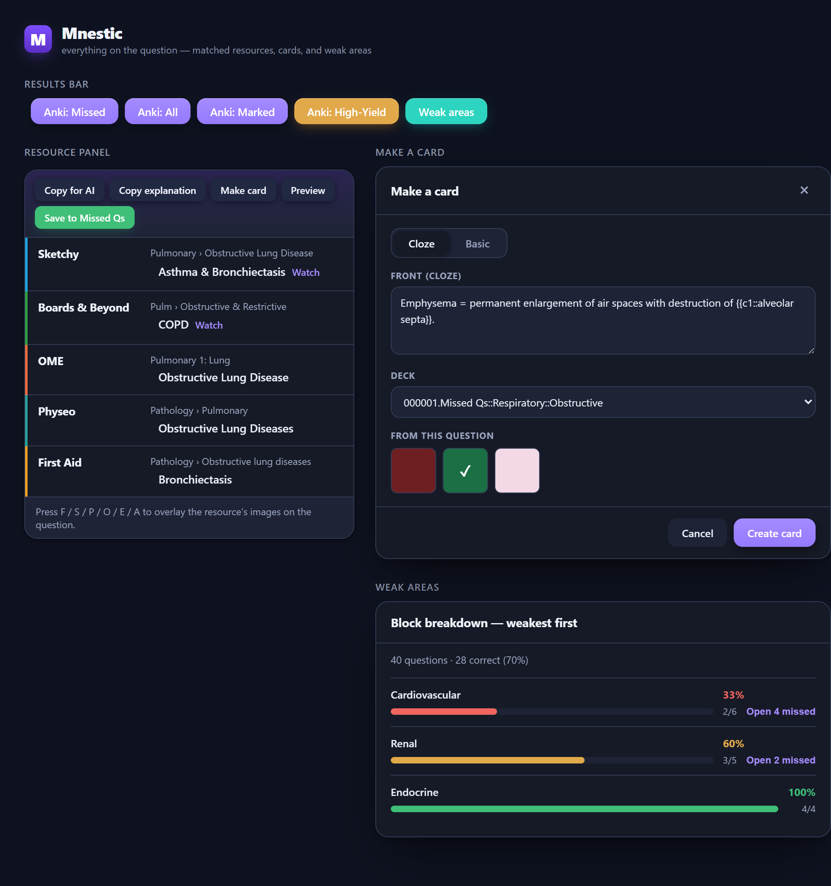
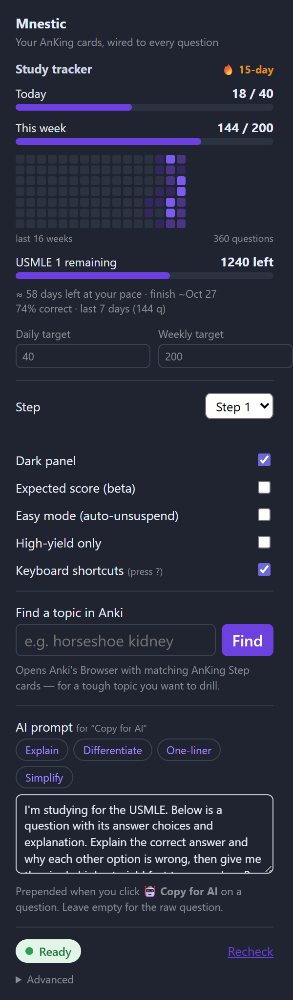

<div align="center">


# Mnestic

**Your qbank question, wired to your AnKing cards.**

[](https://chromewebstore.google.com/detail/mnestic/mdjekpfeinjdgkjbeaffbpfhodofhfhd)
[](https://ankiweb.net/shared/info/199262916)
[](https://github.com/KhaledMD4321/mnestic/releases/latest)
[](LICENSE)
[](https://buymeacoffee.com/bnkhaled)

[**▶️ Promo (1:46)**](https://github.com/KhaledMD4321/mnestic/releases/download/tutorial-media/mnestic-promo.mp4) · [**🎬 Full walkthrough (7 min)**](https://github.com/KhaledMD4321/mnestic/releases/download/tutorial-media/mnestic-real-walkthrough.mp4) · [**🎞️ Feature tour**](#feature-tour) · [**📖 Extension guide**](docs/guide.md) · [**🔌 Add-on guide**](docs/addon-guide.md) · [**Install**](#install) · [**Privacy**](PRIVACY.md)

</div>

---

Answer a question on **UWorld**, **Coursology** or **MedPark**, and Mnestic finds
the AnKing cards tagged with that question's id — then puts everything you'd
otherwise open a tab for **right on the page**: the matched resources and their
images, the card as Anki will show it, a weak-area breakdown of the block, and
your study pace.

Everything runs on your own computer, through a small local link to your own Anki.
**No server, no account, no telemetry.**

<div align="center">

[](https://github.com/KhaledMD4321/mnestic/releases/download/tutorial-media/mnestic-promo.mp4)

<sub>**New to Mnestic?** The [1:46 promo](https://github.com/KhaledMD4321/mnestic/releases/download/tutorial-media/mnestic-promo.mp4) shows the whole idea — then the [feature tour](#feature-tour) below shows each feature on a real qbank.</sub>

</div>

---

## What it does

<table>
<tr>
<td width="50%" valign="top">

### 📚 Resource overlays
Press **F** for First Aid, **S** for Sketchy, **P** for Physeo, **O** for OME —
the matched image appears over the question. No tab-switching, no losing your
place.

</td>
<td width="50%" valign="top">

### ★ Missed questions, organised
Keep a question in a **chapter subdeck** built from its own AnKing tags, with
your notes in the card. Move it, tag it, or copy it — and **undo** any of it.

</td>
</tr>
<tr>
<td valign="top">

### 📊 Weak areas
Break a finished block into per-**System / Subject / Topic** accuracy, weakest
first, and send just those missed questions to Anki.

</td>
<td valign="top">

### 🔥 Study tracker
Daily streak, 16-week heatmap, targets, 7-day accuracy, and a projected finish
date from your real pace.

</td>
</tr>
<tr>
<td valign="top">

### ✚ Make a card
Select any explanation text → a **Make card** chip appears. Cloze or Basic,
straight into Anki, with the question id as the source.

</td>
<td valign="top">

### 🤖 Copy for AI
Your editable prompt + the whole question, copied in one click for ChatGPT,
Claude or Gemini.

</td>
</tr>
</table>

<div align="center">

[**→ Every feature, explained in the full guide**](docs/guide.md)

</div>

---

## Feature tour

Nine short clips, in the order you'll meet each feature. They were recorded on a
real qbank, with the real extension and a real Anki — no mock-ups (see
[Content & copyright](#content--copyright)). Each one is also available as a
sharper **MP4**, and all of them together as one
[**7-minute walkthrough**](https://github.com/KhaledMD4321/mnestic/releases/download/tutorial-media/mnestic-real-walkthrough.mp4) —
see the [tutorial media release](https://github.com/KhaledMD4321/mnestic/releases/tag/tutorial-media).

| | Feature | Where |
|:---:|---|---|
| 1 | [The Mnestic panel](#1-the-mnestic-panel) | Under the explanation of every answered question |
| 2 | [Resource images — F S P O E A](#2-resource-images-over-the-question--f-s-p-o-e-a) | Over the question |
| 3 | [Your AnKing cards](#3-your-anking-cards--preview-unsuspend-open-in-anki) | Preview, unsuspend, open in Anki |
| 4 | [Save to Missed Qs](#4-save-to-missed-qs--with-your-own-note-and-undo) | With your note, into a chapter subdeck — and undo |
| 5 | [Make a card](#5-make-a-card-from-the-explanation) | From any explanation text |
| 6 | [Copy for AI](#6-copy-for-ai) | The whole question, ready for your AI assistant |
| 7 | [After a block](#7-after-a-block--anki-buttons-and-weak-areas) | Anki buttons and Weak areas |
| 8 | [The popup](#8-the-popup--your-pace-your-settings-your-missed-list) | Tracker, pace, settings, missed list |
| 9 | [Keyboard shortcuts](#9-keyboard-shortcuts) | Everything from the keyboard |

### 1. The Mnestic panel

**On every question you've answered.** Mnestic reads the **Question Id** off the
page and, right under the explanation, shows:

- **The AnKing cards tagged with this question** — how many, and how they stand
  (new, young, mature, suspended).
- **Every resource those cards point to** — First Aid, Sketchy, B&B, OME, Bootcamp,
  Physeo, Pixorize… one line each, with the number of **chapters** your cards tag
  there and its image key (hover the key to see how many images it opens).
  **Click a row** to see those chapters; the most-tagged come first.
- **How did that go?** — *Knew it*, *Guessed* or *No idea*. A right answer you only
  guessed still counts as weak.

Nothing appears until you've answered, so it can never spoil a question.


<sub>▶ [MP4 version](https://github.com/KhaledMD4321/mnestic/releases/download/tutorial-media/01-mnestic-panel.mp4)</sub>

### 2. Resource images over the question — F S P O E A

Press a resource's key — or **click its key badge** — and its images open **on
top of the question**. No new tab, no flipping through the book.

| Key | Opens |
|:---:|---|
| **F** | First Aid |
| **S** | Sketchy |
| **P** | Physeo |
| **O** | OME |
| **E** | Extra — the whole field (text and images), card by card |
| **A** | Additional Resources — the whole field, card by card |

**← →** flip pages (the qbank question behind never moves), click a thumbnail to
jump, **Esc** closes. The keys only work after you answer.


<sub>▶ MP4: [First Aid](https://github.com/KhaledMD4321/mnestic/releases/download/tutorial-media/02a-first-aid-images.mp4) · [Sketchy, Extra, Additional](https://github.com/KhaledMD4321/mnestic/releases/download/tutorial-media/02b-sketchy-extra-additional.mp4)</sub>

### 3. Your AnKing cards — preview, unsuspend, open in Anki

- **👁 Preview** — the whole card, answer revealed: Text, Extra, Additional
  Resources and your Missed Questions notes open, every other filled field
  (First Aid, Sketchy, Physeo…) one click away. **Next** shows the other cards
  for the question, most specific to it first.
- **Unsuspend N** — one click and this question's suspended cards are in your
  Anki reviews.
- **Anki** (next to the Question Id), or press **D** — Anki's Browse window opens
  on exactly this question's cards.


<sub>▶ [MP4 version](https://github.com/KhaledMD4321/mnestic/releases/download/tutorial-media/03-cards-preview-unsuspend.mp4)</sub>

### 4. Save to Missed Qs — with your own note, and undo

1. Click **★ Save to Missed Qs** (or press **V**) and pick the card with the fact
   you missed — each one shows its text, answers in bold, and what its Extra says.
2. The **chapter chips** come from the card's own AnKing tags — it saves into that
   chapter's subdeck (`Missed Qs::Respiratory`), reusing a subdeck you already have.
   Pick a chapter deck itself and it saves straight there, with the question's
   subject (Pharmacology, Medicine…) offered as an optional subdeck inside it.
3. **Type your note.** It's *added* to the card's *Missed Questions* field — never
   overwritten — and protected so an AnkiHub update can't wipe it.
4. **Move it** — the real card moves, keeping its review history. (Prefer *Tag only*
   or *Make a copy*? Choose in the popup.)

Changed your mind? Open the dialog again and click **Remove from Missed Qs** —
the card goes back to its deck, and your note stays.


<sub>▶ [MP4 version](https://github.com/KhaledMD4321/mnestic/releases/download/tutorial-media/04-save-to-missed-with-note-and-undo.mp4)</sub>

### 5. Make a card from the explanation

For the fact a question taught you that no card covers:

1. **Select any text** in the explanation — a **✚ Make card** button appears
   (or press **G**).
2. Keep **Cloze**, or switch to **Basic** for a front / back card.
3. Highlight a word and click **Make cloze** — it becomes `{{c1::…}}`.
4. **Create card.** The question's id and link go on the card as its source.

> **Known issue:** in store version **1.3.1**, *Create card* does nothing.
> It's fixed in **1.4.0**.


<sub>▶ [MP4 version](https://github.com/KhaledMD4321/mnestic/releases/download/tutorial-media/05-make-a-card.mp4)</sub>

### 6. Copy for AI

**🤖 Copy for AI** (or **Q**) copies your saved prompt, the question id and link,
and the whole question — paste it into ChatGPT, Claude or Gemini. **📝 Copy
explanation** copies just the explanation, for your own notes. Set the prompt once
in the popup (four presets, or write your own).


<sub>▶ [MP4 version](https://github.com/KhaledMD4321/mnestic/releases/download/tutorial-media/06-copy-for-ai.mp4)</sub>

### 7. After a block — Anki buttons and Weak areas

On your test's results page, Mnestic adds a toolbar:

- **Anki: Missed / All / Marked / High-Yield** — open those questions' cards in Anki.
- **📊 Weak areas** — the block's accuracy by **System**, **Subject** or **Topic**,
  weakest first. **Open N missed** sends just that group's cards to Anki;
  **Drill weakest 3** opens the missed questions from your three weakest groups.


<sub>▶ [MP4 version](https://github.com/KhaledMD4321/mnestic/releases/download/tutorial-media/07-results-and-weak-areas.mp4)</sub>

### 8. The popup — your pace, your settings, your missed list

Click the **M** in Chrome's toolbar (pin it so it's always one click away):

- **Study tracker** — today, this week, your streak, and a 16-week heatmap.
- **Your pace** — questions left in your bank, and a finish date at the pace you
  actually study.
- **Settings** — daily / weekly targets, Step, panel theme, how saving works, your
  Missed Qs deck, and switches for Expected score, Easy mode, High-yield only and
  all keyboard shortcuts.
- **Missed questions by chapter** — **Copy ids** to retest them in your qbank's
  test builder, or **Study them in Anki**.

| Tracker, pace and settings | Missed list and switches |
|:---:|:---:|
|  |  |

<sub>▶ MP4: [tracker and settings](https://github.com/KhaledMD4321/mnestic/releases/download/tutorial-media/08a-popup-tracker-and-settings.mp4) · [missed list and switches](https://github.com/KhaledMD4321/mnestic/releases/download/tutorial-media/08b-popup-missed-list-and-switches.mp4)</sub>

### 9. Keyboard shortcuts

Press **?** on any answered question for the full list. They never fire on an
unanswered question, stay quiet while you type, and switch off in the popup.

| Key | Action |
|:---:|---|
| **F S P O E A** | Resource images |
| **← →** | Flip pages in an image overlay |
| **G** | Make a card from your selection |
| **Q** | Copy for AI |
| **V** | Save to Missed Qs |
| **D** | Open this question's cards in Anki |
| **?** | Show the shortcuts |
| **Esc** | Close an overlay or dialog |


<sub>▶ [MP4 version](https://github.com/KhaledMD4321/mnestic/releases/download/tutorial-media/09-keyboard-shortcuts.mp4)</sub>

<details><summary>🌙 Dark mode</summary><br>

| Interface | Popup |
|:---:|:---:|
|  |  |

</details>

<details><summary>📐 Illustrated overview</summary><br>




| ✚ Make a card — 📎 *From this question* | 🤖 Copy for AI |
|:---:|:---:|
|  |  |

</details>

---

## Supported question banks

| Bank | Status |
|---|---|
| **Coursology** — `coursology-qbank.com` | ✅ verified against the live site |
| **MedPark** — `medpark.io` | ✅ verified against the live site |
| **UWorld** — `uworld.com` | 🧪 **beta** — built against fixtures, not a live account |

All three label questions with the **same UWorld question ids**, which is what
makes one AnKing tag search work everywhere. Two MedPark features are unavailable
for reasons on its side — [details in the guide](docs/guide.md#supported-banks).

---

## Install

**You need:** Anki running · an AnKing deck with UWorld tags · Chrome, Brave or Edge.

*Want it spelled out click by click?* → [**INSTALL.md**](INSTALL.md)

<table>
<tr><td width="33%" valign="top">

### 1️⃣ Anki add-on

**Tools → Add-ons → Get Add-ons…**

```
199262916
```

Then **restart Anki**.

</td><td width="33%" valign="top">

### 2️⃣ Extension

[**Add to Chrome**](https://chromewebstore.google.com/detail/mnestic/mdjekpfeinjdgkjbeaffbpfhodofhfhd) from the Web Store.

Or load it unpacked: `chrome://extensions` → **Developer mode** → **Load
unpacked** → the `extension/` folder.

</td><td width="33%" valign="top">

### 3️⃣ Pair them

**Tools → Mnestic Bridge → Pairing code…**

Paste it into the popup → **Save**. The pill turns **● Ready**.

</td></tr>
</table>

> [!IMPORTANT]
> **Check one question first.** Everything rests on your qbank's question id being
> the same number UWorld used. Take a question id from the page, search
> `tag:#AK_Step1_v*::#UWorld::*::<id>` in Anki's Browse, and confirm the same topic
> comes back. [How and why →](docs/guide.md#2-check-your-ids-match)

<details><summary>Install the add-on manually instead</summary><br>

Copy `anki-addon/mnestic_bridge/` into your Anki add-ons folder, then restart Anki:

| OS | Folder |
|---|---|
| Windows | `%APPDATA%\Anki2\addons21\mnestic_bridge\` |
| macOS | `~/Library/Application Support/Anki2/addons21/mnestic_bridge/` |
| Linux | `~/.local/share/Anki2/addons21/mnestic_bridge/` |

</details>

---

## How it works

The AnKing deck tags every UWorld question with its id, and all three banks use
those same ids. So the matching is one local Anki search — no server, no database:

```
Question Id 1633   →   (tag:#AK_Step1_v*::#UWorld::Step::1633
                        OR tag:#AK_Step1_v*::#UWorld::1633)
```

The extension reads the id off the page; the **Mnestic Bridge** add-on
(`127.0.0.1:8790`) runs that search in your own collection and returns the cards.

Both tag shapes are tried because AnKing has used both — older decks and Step 3
carry the bare form. A wildcard fallback exists for anything else, but it is
never tried first: it can reach into other exam namespaces and match the wrong
question.

---

## Safety

Mnestic can read the page you're studying and **write to your Anki collection**,
so the limits are worth stating plainly:

- **Nothing leaves your computer.** No server, no account, no analytics.
- **The bridge is locked to loopback**, needs your pairing code on every request,
  and refuses any request whose origin is a website.
- **The add-on cannot delete your cards.** Its one delete operation exists to undo
  a *Make a copy* save and refuses any note it did not itself create.
- **It only removes its own tags** — never `marked`, `leech`, an AnKing tag, or the
  `AnkiHub_Protect` tag guarding notes you typed.

Full detail, and how to report a problem: [SECURITY.md](SECURITY.md) ·
[PRIVACY.md](PRIVACY.md)

---

## Repo layout

```
extension/               the browser extension
  manifest.json          the qbank sites it runs on
  content.js             matching engine, site adapters, every on-page feature
  background.js          proxy to the bridge at 127.0.0.1:8790
  popup.html/.js         tracker, settings, missed list, pairing
anki-addon/
  mnestic_bridge/        the Anki add-on — local bridge + Tools menu
scripts/                 build, test and the demo recorder
docs/                    the guides, release runbook, store copy, demo media
```

<details><summary>Building and testing</summary><br>

```bash
python scripts/check-addon.py    # the add-on can actually import
python scripts/check-listing.py  # store copy fits the store's limits
python scripts/guard-test.py     # destructive ops refuse what they should
node   scripts/adapter-test.js   # every site adapter still parses its pages
node   scripts/e2e-test.js       # the real extension, in a real browser
```

Re-record the demos in `docs/media/` (drives the real extension, needs ffmpeg):

```bash
node scripts/demo-capture.js            # stills + GIFs
node scripts/demo-capture.js --shots    # stills only, much faster
```

Release process: [docs/releasing.md](docs/releasing.md)

</details>

---

## Support

Mnestic is free and open source, with no ads, accounts, or paid tier — and it will
stay that way. If it saved you time, you can
[**☕ buy me a coffee**](https://buymeacoffee.com/bnkhaled). Entirely optional;
nothing is locked behind it.

Something broken? [Open an issue](https://github.com/KhaledMD4321/mnestic/issues).

---

## Content & copyright

**Mnestic does not include, host or own any qbank question or study resource.**
It is a tool that links the sources *you* already have — your qbank subscription
and your own AnKing deck in your own Anki — so you can use them together. Every
question, image and resource it shows comes from those, on your own computer.

The recordings in this README and in the [guide](docs/guide.md) were made the same
way: on the author's own qbank subscription and own AnKing deck. The question
text, images and resource names in them belong to their respective owners —
UWorld, Coursology, MedPark, First Aid, Sketchy, Physeo, OME, Boards & Beyond,
Bootcamp, Pixorize, AnKing and others — and appear only to show how the
extension works. Mnestic is not affiliated with, or endorsed by, any of them.

If you own content shown here and want it removed, please
[open an issue](https://github.com/KhaledMD4321/mnestic/issues) and it will be
taken down.

---

## Credits & license

**[GNU GPL v3](LICENSE).** You may use, study, modify and share it — anything you
distribute that builds on it must stay open under the same licence, with credit.

The core idea — mapping a qbank's question ids onto AnKing's UWorld tags — was
**inspired by [Atlas](https://github.com/TheEverion/Atlas)** by TheEverion.
Mnestic is an independent project written from scratch, with its own extension and
its own add-on; it includes no Atlas code. Thanks to TheEverion for the concept.

**Not affiliated** with Coursology, UWorld, MedPark, AnKing, Anki, Sketchy, Boards
& Beyond, Physeo, First Aid, or any other resource. Use your own accounts and your
own decks. Resource names and images belong to their owners; Mnestic only points
to content already in your AnKing deck.

<div align="center"><sub>A personal, educational study tool.</sub></div>
