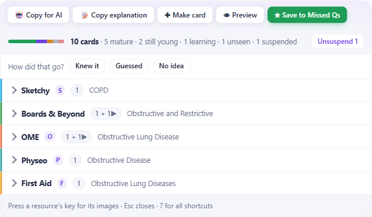
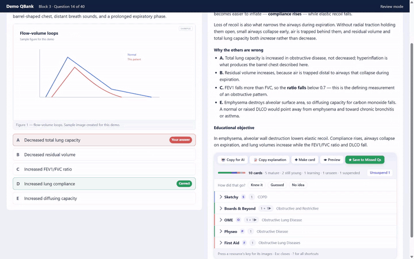
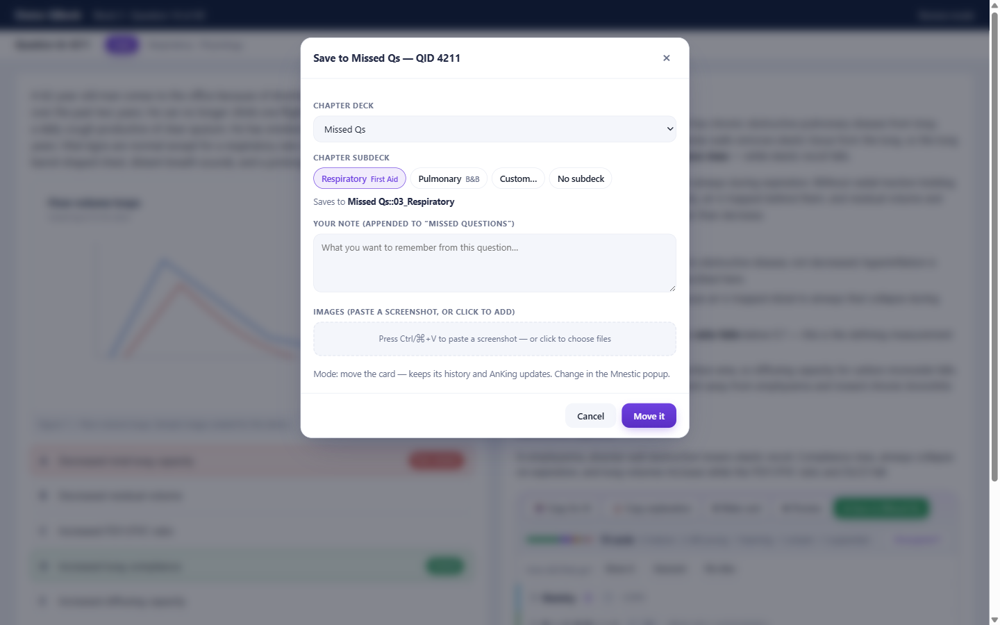
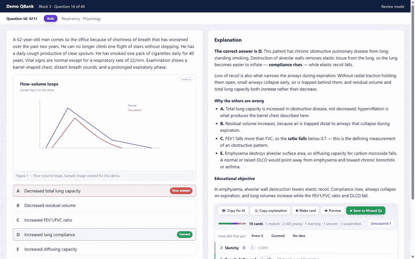
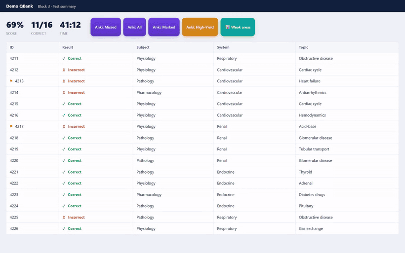
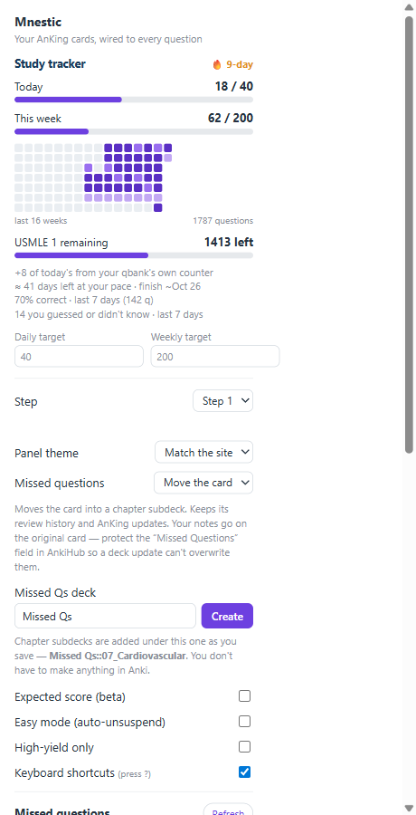

# Mnestic — the complete guide

**[Get the extension](https://chromewebstore.google.com/detail/mnestic/mdjekpfeinjdgkjbeaffbpfhodofhfhd)** ·
**[get the add-on](https://ankiweb.net/shared/info/199262916)** ·
**[the add-on's own guide](addon-guide.md)** ·
**[source](https://github.com/KhaledMD4321/mnestic)**

Everything Mnestic does, in the order you'll meet it.

**New here?** Do [Setup](#1-setup) and [Check your ids match](#2-check-your-ids-match)
first — the second takes 30 seconds and tells you whether this will work for your
deck at all.

---

## Contents

| | |
|---|---|
| **[1. Setup](#1-setup)** | Install the add-on and extension, pair them |
| **[2. Check your ids match](#2-check-your-ids-match)** | The one assumption everything rests on |
| **[3. On a question](#3-on-a-question)** | Resource panel, image overlays, card readiness |
| **[4. The four buttons](#4-the-four-buttons)** | Copy for AI, Copy explanation, Preview, Save |
| **[5. Missed questions](#5-missed-questions)** | Three ways to keep one, chapter subdecks, undo |
| **[6. Make a card](#6-make-a-card)** | Turn any explanation text into a new card |
| **[7. After a block](#7-after-a-block)** | Results buttons and the weak-area breakdown |
| **[8. The popup](#8-the-popup)** | Tracker, missed list, settings, topic search |
| **[9. Keyboard shortcuts](#9-keyboard-shortcuts)** | All of them |
| **[10. In Anki](#10-in-anki)** | The Tools menu, and what the add-on will not do |
| **[11. Troubleshooting](#11-troubleshooting)** | When something doesn't match |

---

## 1. Setup

You need **Anki open**, an **AnKing deck with UWorld tags**, and Chrome (or Brave
/ Edge).

*Prefer it spelled out click by click?* → [**INSTALL.md**](../INSTALL.md)

### Step 1 — the Anki add-on

**Tools → Add-ons → Get Add-ons…** and paste:

```
199262916
```

Then **restart Anki**. The add-on runs a small server on `127.0.0.1:8790` that
only the extension talks to. ([AnkiWeb page](https://ankiweb.net/shared/info/199262916) ·
[what the add-on does](addon-guide.md))

### Step 2 — the extension

[**Add Mnestic to Chrome**](https://chromewebstore.google.com/detail/mnestic/mdjekpfeinjdgkjbeaffbpfhodofhfhd) — that's the whole step.

<details><summary>Or load it unpacked</summary>

1. `chrome://extensions` → turn on **Developer mode**
2. **Load unpacked** → pick the `extension/` folder

</details>

### Step 3 — pair them

The bridge needs a private **pairing code**, so nothing else on your computer can
reach your collection through it.

1. In Anki: **Tools → Mnestic Bridge → Pairing code…** (it copies to your clipboard)
2. Open the Mnestic popup → paste it into **Pairing code** → **Save**
3. The pill turns **● Ready**

> **The popup tells you what's missing.** A first-run checklist at the top shows
> three ticks — Anki running, paired, and a Missed Qs deck — and each links to the
> thing that fixes it. The deck it can create for you.

---

## 2. Check your ids match

Everything rests on one assumption: **your qbank's question id is the same number
UWorld used**, and your AnKing cards carry it. Check one question before relying
on it.

1. On a question, note the header: **Question Id: 1633**
2. In Anki's **Browse**, search:

   ```
   tag:#AK_Step1_v*::#UWorld::*::1633
   ```

3. **Same topic comes back?** The ids line up — everything will work.
   **Nothing, or an unrelated card?** Your qbank renumbered its questions, and the
   tag approach won't work as-is.

The popup's **Advanced → Check my deck** does the same count for you across all
three steps.

---

## 3. On a question

Answer it first. **Mnestic shows nothing until the explanation is visible** — it
will never spoil an unanswered question.

### The resource panel



The resources your AnKing card links to — Sketchy, Boards & Beyond, First Aid,
Physeo, OME, Picmonic and others — appear beside the explanation, **collapsed to
one line each**, showing the topics covered, the overlay key, and how many
chapters. Open the ones you use; it remembers, and floats what you open most to
the top.

Step 2 and Step 3 resources show alongside the Step 1 ones.

### Image overlays — the one you'll use every question

With the explanation open, press a key and that resource's images appear **over
the question**:

| Key | Resource |
|:---:|---|
| **F** | First Aid |
| **S** | Sketchy |
| **P** | Physeo |
| **O** | OME |
| **E** | Extra |
| **A** | Additional Resources |



Multi-page resources page with **← →**, show *2 / 5*, and carry a filmstrip of
every page. Images are fetched while you read, so the first keypress is instant.
**Esc** closes.

### The readiness strip

A line under the buttons says how the matching cards actually stand —
*9 cards · 3 mature · 2 suspended* — with one-click **Unsuspend**.

### Quick open in Anki

A small **Anki** button beside the question id opens that question's cards in
Anki's Browser. (Shortcut: **D**.)

---

## 4. The four buttons

At the top of the resource panel.

### 🤖 Copy for AI — **Q**

Copies your **AI prompt** + the question id + link + the whole question (stem,
choices, explanation) — ready to paste into ChatGPT, Claude or Gemini.

Edit the prompt in the popup. Four presets: **Explain**, **Differentiate**,
**One-liner**, **Simplify**. Leave it empty to copy the raw question.

### 📝 Copy explanation

Just the qbank's explanation text, for your own notes.

### 👁 Preview

Reads the matched card(s) without opening Anki — clozes revealed, images inline,
with **‹ Prev / Next ›** across every card matched to the question.

### ★ Save to Missed Qs — **V**

The big one — see below.

---

## 5. Missed questions

Worth understanding properly, because it writes to your collection.

### Three ways to keep one

Choose in the popup under **Missed questions**. Change it whenever you like — it
is not a one-time decision, and each save uses whatever is selected at the time.

| Mode | What happens | Keeps AnKing updates? |
|---|---|:---:|
| **Move the card** *(default)* | The real card moves into a chapter subdeck, keeping its review history. | ✅ |
| **Tag only** | Nothing moves. The note is tagged `Mnestic::Missed::<chapter>`. | ✅ |
| **Make a copy** | A duplicate note in the subdeck — a separate card from then on. | ❌ |

**Move** is the default because it gives you a real, studiable subdeck without
duplicating anything, and the note keeps its `ankihub_id`, so AnKing updates keep
arriving.

### Chapter subdecks



The dialog offers chapters read from the card's **own AnKing tags** — organ
systems on Step 1, rotations on Step 2 — so your missed pile stays studiable by
topic instead of becoming one undifferentiated heap.

It **reuses a subdeck you already have**. If your decks are named
`01_Cardiology, 02_Renal, 03_Respiratory`, a respiratory question lands in
`03_Respiratory` — not a second, parallel `Respiratory` beside it.

You can also choose *no subdeck*, or type your own.

> A newly created subdeck **inherits the options preset** of the deck the card
> came from, rather than silently landing on Default and changing your daily
> limits.

### Your notes

Whatever you type goes into the card's **Missed Questions** field, appended — so
a second save on the same question adds to your note rather than replacing it or
duplicating anything.

Because Mnestic writes there, it also tags the note
`AnkiHub_Protect::Missed_Questions`. Without that, a routine AnkiHub deck update
can overwrite the field and take a term of notes with it.

### Images

Three ways to attach:

- **Paste** a screenshot straight into the dialog
- **Click to add** files
- **📎 From this question** — thumbnails of the question's own images; click only
  the ones worth keeping

*(The last is unavailable on MedPark — see [Supported banks](#supported-banks).)*

### Undoing a save



Reopen the dialog on a saved question. It says **"Already in Missed Qs"** and
offers **Remove from Missed Qs**, which undoes whichever save actually happened:

- **tag** — removes `Mnestic::Missed` and its chapter child
- **move** — that, **and moves the card back to the deck it came from**
- **copy** — that, **and deletes the copy**

**It never touches your notes.** The *Missed Questions* field and the
`AnkiHub_Protect` tag guarding it are left exactly as they are.

If you've since refiled the card somewhere of your own, **your filing wins** —
undo unties it from Missed Qs and leaves it where you put it.

> Copies made before v1.3.0 carry no marker tag, so undo will refuse to delete
> them and say so. Those need Anki's Browse window.

### Studying them

In the popup: your missed questions grouped by chapter, with **Copy ids** per
group (paste straight into your qbank's test builder) and **Study them in Anki**,
which builds a filtered deck — cards return to their home decks afterwards, so
studying them costs nothing permanent.

---

## 6. Make a card — **G**

Select any text in the explanation and a floating **✚ Make card** chip appears.

- **Cloze** or **Basic**
- Picks a matching note type from your own collection
- Created with the question id + link as the source
- Paste screenshots into it too

For the fact a question taught you that no existing card covers.

---

## 7. After a block

On the results / score table.

### The buttons

| Button | What it opens |
|---|---|
| **Anki: Missed** | Cards for every question you got wrong or omitted |
| **Anki: All** | Every question in the block |
| **Anki: Marked** | The ones you flagged |
| **Anki: High-Yield** | Only the high-yield cards among them |
| **📊 Weak areas** | The breakdown below |

> **Open the "Question List" popup once per test.** That's where *Marked* and an
> un-paginated *All / Missed* come from — and it's the only source that can tell
> **omitted** from **correct**, which the score table cannot.

With **Easy mode** on (popup), these unsuspend the cards instead of just opening
them.

### Weak-area breakdown



Per **System / Subject / Topic** accuracy for the block, **weakest first**, with:

- **Open N missed** — sends just that group to Anki
- **Drill weakest 3** — sends the three worst groups at once

---

## 8. The popup

Click the Mnestic icon.

### Study tracker



- **Today** and **this week** against your targets
- 🔥 **Daily streak**
- **16-week heatmap**
- **Remaining** vs the qbank total — *visit your qbank's dashboard once* so it can
  read Used / Unused / Total
- **Projected finish date** at your current pace
- **7-day accuracy**

It keeps two signals separate: the **qbank's own counter** says how many
questions you did, and **Mnestic's log** says which ones and how they went. So it
credits blocks it never watched, and re-baselines instead of going negative when a
qbank resets.

### Settings

| Setting | What it does |
|---|---|
| **Step** | Which AnKing step to search. Auto-detected from the URL; this is the fallback. |
| **Dark panel** | Match the site / Light / Dark |
| **Missed questions** | Move / Tag only / Make a copy, plus the deck name |
| **Expected score (beta)** | Estimates a score from your cards' maturity |
| **Easy mode** | Results buttons unsuspend instead of just opening |
| **High-yield only** | Results buttons open only high-yield cards |
| **Keyboard shortcuts** | Turn them off |

### Find a topic in Anki

Type a topic → opens Anki's Browser with the matching AnKing Step cards. For
drilling something tough outside the qbank.

### AI prompt

The text **Copy for AI** puts in front of the question. Four presets, or write
your own.

### Advanced

- **Port** — if `8790` clashes with something else
- **Check my deck** — how many notes carry UWorld tags, per step
- **Check this page** — what the extension can see on the current tab. Reports
  **structure only** (tag names, ids, class names) — never question text, answers,
  or account details — and **Copy report** puts it on the clipboard for a bug
  report

---

## 9. Keyboard shortcuts

On the question page, once the explanation is open. Ignored while you're typing in
a field. Turn them off in the popup.

| Key | Action |
|:---:|---|
| **F S P O E A** | Overlay First Aid / Sketchy / Physeo / OME / Extra / Additional |
| **← →** | Page through a multi-page overlay |
| **G** | Make a card |
| **Q** | Copy for AI |
| **V** | Save to Missed Qs |
| **D** | Open this question in Anki |
| **?** | Shortcut cheatsheet |
| **Esc** | Close the overlay or dialog |

---

## 10. In Anki

The add-on has its own guide — what it can do, what it refuses to do, its
settings and its troubleshooting: **[Mnestic Bridge guide](addon-guide.md)**.
The short version:

**Tools → Mnestic Bridge**

| Item | What it does |
|---|---|
| **Pairing code…** | Shows and copies your code |
| **Issue a new pairing code…** | Rotates it. Do this if it ever leaks — then re-paste it into the popup. |
| **Status and deck check…** | Version, profile, and how many notes carry UWorld tags per step |

### What the add-on will not do

- **It cannot delete your cards.** Its one delete operation exists to undo a
  *Make a copy* save, and refuses any note that is not a copy Mnestic itself
  created — the note must carry Mnestic's marker tag and must not be
  AnkiHub-managed.
- **It only removes its own tags.** Nothing can strip `marked`, `leech`, an AnKing
  tag, or the `AnkiHub_Protect` tag guarding notes you typed.
- **Nothing leaves your machine.** No server, no account, no telemetry. It binds to
  loopback, requires the pairing code on every request, and refuses requests whose
  origin is a website.

---

## 11. Troubleshooting

### "Anki isn't running"

Anki must be **open**, with the add-on installed and Anki **restarted** since. If
it still says this, check **Tools → Add-ons** for a startup error.

### A question isn't matching

1. Check the id lines up — [section 2](#2-check-your-ids-match).
2. Wrong step? The popup's **Step** selector overrides URL detection.
3. Still nothing? The panel shows the exact Anki search it tried. Paste that into
   Browse and see what your deck actually has.

### Nothing appears on the question

Mnestic waits for the explanation to be visible, so it cannot spoil an unanswered
question. If you have answered and still see nothing, use **Advanced → Check this
page** and include the report in a bug report.

### The pairing code stopped working

A new one was issued. **Tools → Mnestic Bridge → Pairing code…**, then paste it
into the popup again.

### Port 8790 is in use

Change it in **Tools → Add-ons → Mnestic Bridge → Config**, restart Anki, then set
the same port in the popup's **Advanced**.

---

## Supported banks

| Bank | Status |
|---|---|
| **Coursology** (`coursology-qbank.com`) | ✅ verified against the live site |
| **MedPark** (`medpark.io`) | ✅ verified against the live site |
| **UWorld** (`uworld.com`) | 🧪 beta — built against fixtures, not a live account |

All three label questions with the **same UWorld question ids**, which is what
makes one AnKing tag search work everywhere.

**Two things do not work on MedPark**, for reasons on its side: the results-page
buttons and Weak areas (its Test Summary reports totals only — there is no
per-question id table to read), and **📎 From this question** (it serves question
figures from a third-party storage domain, and granting fetch access to a host
neither you nor MedPark controls is not a trade worth making). Paste and
file-picker attach still work.

---

## About the images in this guide

Every screenshot and GIF here was recorded by driving the real extension in a
real browser (`scripts/demo-capture.js`) — none of it is a mock-up. The question,
the card and the diagrams are written for the demo and labelled SAMPLE; they are
not pages from First Aid, Sketchy, Physeo or any other resource. Resource *names*
appear because those come from the tags on your own deck.

---

*Found something that doesn't behave like this?*
[Open an issue](https://github.com/KhaledMD4321/mnestic/issues).
